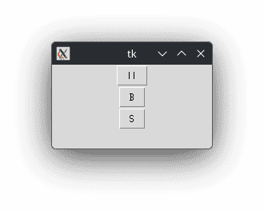
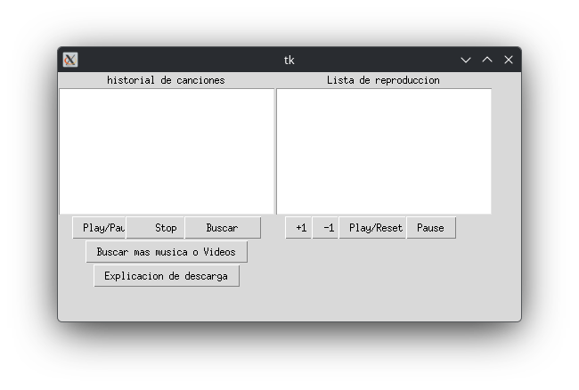
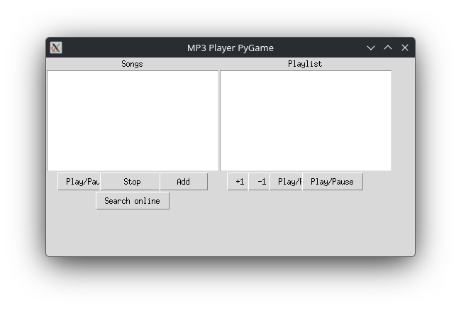

# MP3 Player PyGame

This is a simple MP3 player developed along with a classmate for a high school project.

Crafted under tigh deadlines, lack of sleep and incredible amounts of scope creep.
## Features

- Import MP3 and WAV files.
- Play, pause, and stop audio controls.
- Add or remove songs from a custom playlist.
- Sequential playlist playback.
- Search for more songs.

## Screenshots

- v1.0

- v2.0

- v2.1

